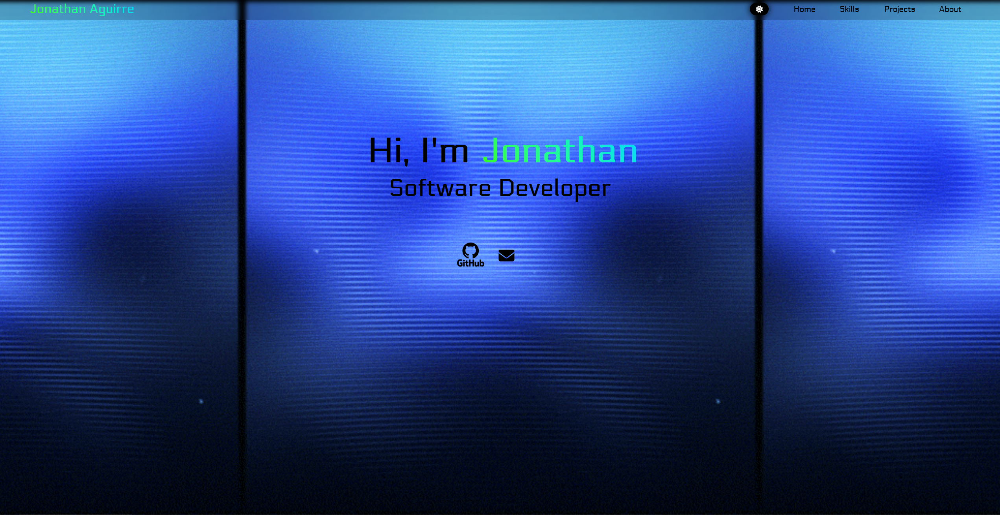

# Getting Started
Personal Website showcasing an overview of my skills, resume, and projects.

# Files

* index.html : This file contains the HTML code for the app.
* style.css : This file contains the CSS code for the app.
* script.js : This file contains the JavaScript code for the apps functionality. 
* images Folder : This folder contains the images which are used in the README, icon, and on the project itself.

